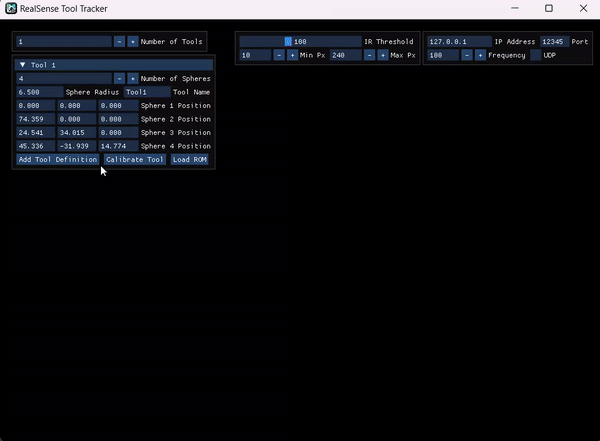
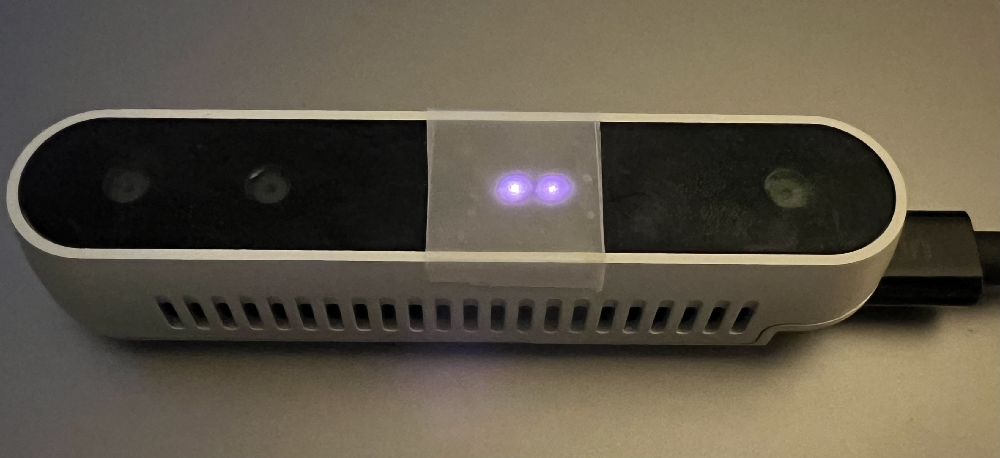
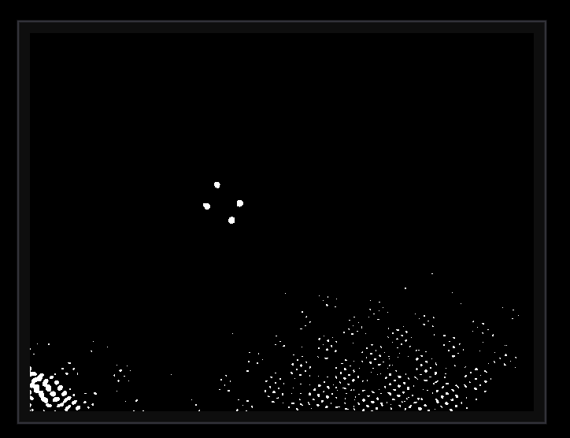

# IR Retro-reflective Marker Tracking with Intel RealSense

[](https://github.com/stytim/RealSense-ToolTracker/releases)

This project leverages the versatility of Intel RealSense cameras, enabling high-quality tracking of passive IR sphere markers without the need for large and expensive equipment like NDI trackers.

<p align="center">
	
</p>


## Project Highlights
* **Compact and Cost-Effective**: Break free from the constraints of traditional tracking systems. Our project utilizes the small, affordable Intel RealSense camera for efficient tracking.
* **Versatile and User-Friendly**: Efficiently handle simultaneous tracking of various markers. Enjoy robust features such as multiple marker tracking, occlusion resistance, and support for various marker types and sizes.
* **Smooth and Stable Tracking**: Integrate Kalman and low-pass filters for stable tracking.
* **Enhanced Communication and Compatibility**: Utilize UDP messaging for transmitting tracking results and support for NDI .rom files
* **Simple Calibration**: A simple marker array calibration is provided if the marker configuration is not known beforehand
* **Cross-Platform Availability**: Works across Linux, Windows, and MacOS environments.

## Installation
**Quick Start with Precompiled Binary (Windows):** Download the latest precompiled binary from our releases section for immediate use.

**Building from Source:** For those interested in customizing or contributing to the project, please see the build instructions below.

## Prerequisites

* Intel RealSense SDK (MacOS users, please refer to the FAQ for installation guidance)
* OpenCV 4
* CMake 

## Building
Ensure all the prerequisites are installed before proceeding with the build process.

### Linux (Ubuntu 22.04 / 24.04 / 26.04)

Install the build dependencies. Intel's RealSense apt repo only publishes for
select LTS codenames (`bionic`/`focal`/`jammy`/`noble`); on a newer release
(e.g. 26.04 "resolute") it 404s, so the snippet below falls back to the newest
supported LTS — those packages are forward-compatible.

```bash
sudo apt-get update
sudo apt-get install -y \
  ca-certificates curl gnupg lsb-release \
  build-essential cmake ninja-build pkg-config patchelf \
  libopencv-dev \
  libgl1-mesa-dev libglu1-mesa-dev \
  libx11-dev libxext-dev \
  libxinerama-dev libxcursor-dev libxi-dev libxrandr-dev \
  libwayland-dev libxkbcommon-dev wayland-protocols \
  libusb-1.0-0-dev libudev-dev \
  libgtk-3-dev

# Intel RealSense SDK from Intel's apt repo (with LTS-codename fallback)
sudo install -m 0755 -d /etc/apt/keyrings
curl -fsSL "https://keyserver.ubuntu.com/pks/lookup?op=get&search=0xFB0B24895113F120&options=mr" \
  | sudo gpg --dearmor -o /etc/apt/keyrings/librealsense.gpg
sudo chmod 0644 /etc/apt/keyrings/librealsense.gpg
RS_CODENAME="$(lsb_release -cs)"
curl -fsSL -o /dev/null "https://librealsense.intel.com/Debian/apt-repo/dists/${RS_CODENAME}/Release" || RS_CODENAME=noble
echo "deb [signed-by=/etc/apt/keyrings/librealsense.gpg] https://librealsense.intel.com/Debian/apt-repo ${RS_CODENAME} main" \
  | sudo tee /etc/apt/sources.list.d/librealsense.list
sudo apt-get update
# librealsense2-udev-rules lets a non-root user access the camera (otherwise the
# USB device nodes are root-only and the app reports "No RealSense devices found").
sudo apt-get install -y librealsense2-dev librealsense2-utils librealsense2-udev-rules
```

> The prebuilt `.deb` already installs these udev rules for you.

Then build:

```bash
cmake -S . -B build -DCMAKE_BUILD_TYPE=Release
cmake --build build --parallel
```

> The build targets a portable x86-64 baseline so the binary runs on any
> machine. For a CPU-tuned local build, add `-DIRTRACK_NATIVE_ARCH=ON` (uses
> `-march=native`; the result is not redistributable).

> Prefer the prebuilt `.deb` from the
> [Releases page](https://github.com/stytim/RealSense-ToolTracker/releases) if
> you just want to run the app — it bundles RealSense/OpenCV and installs on
> Ubuntu 22.04/24.04/26.04.

### For MacOS:

```bash
mkdir build && cd build
cmake ..
make
```
### For Windows
On Windows, you'll need to use CMake to generate build files specific to your platform (e.g., Visual Studio). After generating these files, you can build the project using your chosen IDE or build system.
Note: I have only tested this build process with Visual Studio 2022.


## Running

The application no longer opens a separate console window when launched from a
GUI (a CMD window on Windows or a Terminal window on macOS). Instead, all log
output is shown in a **Log console docked along the bottom of the app window**.
When you launch the app from a terminal, the same logs are also printed to that
terminal.

### For Linux and Windows:
```bash
./ir-tracking-app
```
On Windows the app is now a GUI-subsystem executable, so double-clicking it (or
its Start-menu shortcut) does not spawn a CMD window. Run it from `cmd` /
PowerShell if you want the logs in your terminal as well.

### For MacOS
The build now produces an `ir-tracking-app.app` bundle, so you can launch it
from Finder without a Terminal window appearing:
```bash
open build/ir-tracking-app.app
```
To see the logs in your terminal as well (and to run with elevated privileges
for camera/USB access), run the binary inside the bundle directly:
```bash
sudo ./build/ir-tracking-app.app/Contents/MacOS/ir-tracking-app
```
> Note: on macOS, tool definitions (`Tools/`) and recorded CSV files are stored
> under `~/Library/Application Support/IR Tracking App/` regardless of how the
> app is launched (the data directory is also printed to the log console at
> startup). On Windows and Linux these are read/written relative to the current
> working directory, as before.
## RealSense Camera Modification: Adding a Light Diffuser

The laser projector of the RealSense camera emits a sharp, focused IR dot pattern. While this is generally beneficial for depth sensing, it is not ideal for doing thresholding on IR stream to find retroreflective surfaces.

Therefore, a crucial modification is required: the addition of a physical light diffuser filter in front of the camera's laser projector. This softens the laser dot pattern in the IR stream. 
    <table>
        <tr>
            <td align="center" width="45%">
                <br>
                RealSense with Light Diffuser
            </td>
            <td align="center" width="45%">
                <br>
                Without Light Diffuser, the visible dot pattern can interfere with detecting retroreflective surfaces in the IR stream.
            </td>
        </tr>
    </table>
</p>


## Usage Guide

Upon launching the RealSense Tool Tracker, the application will attempt to load previously defined tool configurations from the 'Tools' directory. Follow the steps below to set up your environment and begin tracking:

### 1. Tool Configuration:

* Number of Tools: Specify how many tools you wish to track.
* Tool Details: For each tool, define the following:
  - Number of Spheres: Indicate how many spheres are attached to each tool.
  - Sphere Radius: Enter the radius for each sphere to ensure precise tracking.
  - Tool Name: Assign a unique name for easy identification.
  - Sphere Positions: Input the positions of each sphere relative to the tool's coordinate system.

* Tool Configuration:
  - Load ROM (Optional): To use pre-defined configurations, click "Load ROM" and choose the relevant NDI ROM file
  - Calibrate Tool (Optional): If the configuration is unknown, ensure no reflective objects are in the camera's view, then calibrate by clicking "Calibrate Tool."
  - Add Tool Definition: Finalize the setup and enable tracking by clicking "Add Tool Definition."
  - Repeat this process for multiple tools as needed.

### 2. Network Configuration

* Input the "IP Address" and "Port" for networked UDP messaging.
* Transmission Rate: Confirm the "Frequency" of tracking updates to suit your needs.
* UDP Enable: Ensure the "UDP" checkbox is selected to activate network transmission.

### 3. Start Tracking
* Initiate Tracking: With all parameters set, initiate tracking by clicking "Start Tracking."
* Real-Time Adjustments: You can tweak the Tracking Parameters in real-time to adapt to varying conditions.
  - Infrared Sensitivity: Adjust the "IR Threshold" to optimize infrared tracking sensitivity.
  - Pixel Range: Set the "Min Px" and "Max Px" to define the acceptable pixel range for detection.
* Results Monitor: The application will display the position and orientation data for each configured tool.

### Additional Resources
A sample Python and a C# Unity scripts is provided for receiving and processing the tracking data via UDP.

## Contributing
Contributions are welcome! When submitting a pull request, please include a description of your improvements and reference any relevant issue numbers.

## Frequently Asked Questions (FAQs)
### Can I use Azure Kinect Cameras for this project?

Currently, Azure Kinect Cameras have an issue with marker overexposure, which affects the retrieval of valid depth values. For more insights, please refer to the discussion on [Azure-Kinect-Sensor-SDK Issue #1349](https://github.com/microsoft/Azure-Kinect-Sensor-SDK/issues/1349). 
However, I have a hack regarding this issue. To put it simply, I sampled the pixels around the overexposed areas and used them to estimate the depth of the marker. Please refer to the [AzureKinect Tool Tracker](https://github.com/stytim/AzureKinect-ToolTracker)

### I'm encountering issues while installing the Intel RealSense SDK on MacOS. What should I do?

Installation issues on MacOS can be tricky due to Intel dropping support for newer MacOS and Mac with Apple silicon. I recommend this comprehensive guide on [setting up Intel RealSense on MacOS](https://lightbuzz.com/realsense-macos/). 


## License and Citation

This project is distributed under the MIT License.

The core idea of the tracking algorithm is based on the following publication:

```bibtex
@ARTICLE{10021890,
  author={Martin-Gomez, Alejandro and Li, Haowei and Song, Tianyu and Yang, Sheng and Wang, Guangzhi and Ding, Hui and Navab, Nassir and Zhao, Zhe and Armand, Mehran},
  journal={IEEE Transactions on Visualization and Computer Graphics}, 
  title={STTAR: Surgical Tool Tracking using Off-the-Shelf Augmented Reality Head-Mounted Displays}, 
  year={2023},
  volume={},
  number={},
  pages={1-16},
  doi={10.1109/TVCG.2023.3238309}}

```
A significant portion of the tracking code is adapted from Andreas Keller's work:
```BibTeX
@misc{keller2023hl2irtracking,
  author =       {Andreas Keller},
  title =        {HoloLens 2 Infrared Retro-Reflector Tracking},
  howpublished = {\url{https://github.com/andreaskeller96/HoloLens2-IRTracking}},
  year =         {2023}
}
```


<picture>
  <source media="(prefers-color-scheme: dark)" srcset="https://api.star-history.com/svg?repos=stytim/RealSense-ToolTracker&type=Date&theme=dark" />
  <source media="(prefers-color-scheme: light)" srcset="https://api.star-history.com/svg?repos=stytim/RealSense-ToolTracker&type=Date" />
  
</picture>
